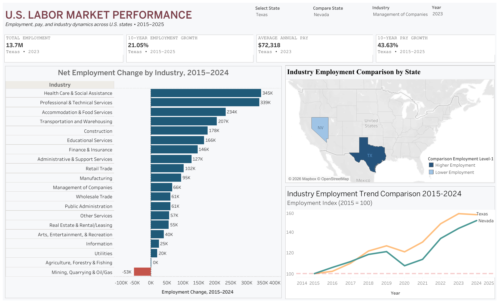
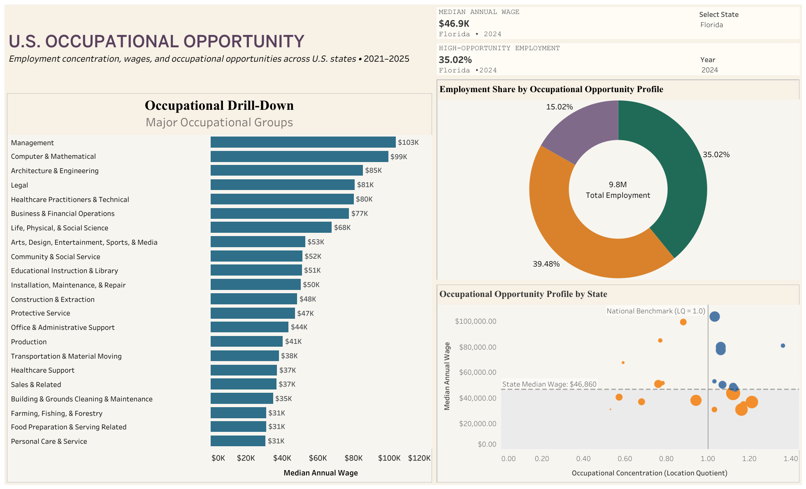

# U.S. Labor Market Analysis

An end-to-end labor market analytics project examining how employment, pay, industry structure, and occupational opportunity vary across U.S. states.

The project combines U.S. Bureau of Labor Statistics (BLS) data from the Quarterly Census of Employment and Wages (QCEW) and Occupational Employment and Wage Statistics (OEWS) with Python-based data preparation, validation, exploratory analysis, and interactive Tableau dashboards.

## Analytical Question

How is the U.S. labor market changing across locations, industries, and occupations, and where are the strongest opportunities or challenges?

---

## Project Overview

The analysis is organized into three connected layers:

| Analytical Layer | Focus |
| --- | --- |
| State Performance | Employment and average-pay changes across U.S. states from 2015–2025 |
| Industry Dynamics | Industries contributing most to employment gains or losses within states |
| Occupational Opportunity | Employment scale, wages, and local concentration across occupations |

Together, these layers move from broad state-level performance to the industries driving that performance and finally to the occupational structure within individual states.

---

## Interactive Tableau Dashboards

### U.S. Labor Market Performance

The first dashboard provides an executive view of state labor-market performance and industry dynamics.

It allows users to:

- Compare employment and pay indicators across states.
- Examine long-term state employment growth.
- Identify industries contributing to employment gains or losses.
- Compare industry employment between two states.
- Examine industry employment trajectories from 2015–2024.

[View the interactive U.S. Labor Market Performance Dashboard on Tableau Public](https://public.tableau.com/shared/ZRMKGCPDJ?:display_count=n&:origin=viz_share_link)

### U.S. Occupational Opportunity

The second dashboard examines occupational opportunity within a selected state using employment scale, wages, and Location Quotient (LQ).

It allows users to:

- Compare major occupational groups.
- Identify occupations combining above-state-median wages with above-national employment concentration.
- Examine employment composition across occupational opportunity profiles.
- Drill down from major occupational groups into detailed occupations.

[View the interactive U.S. Occupational Opportunity Dashboard on Tableau Public](https://public.tableau.com/views/Workforce-project-Public/U_S_OCCUPATIONALOPPORTUNITYDashboard?:language=en-US&:display_count=n&:origin=viz_share_link)

---

## Key Findings

### State Employment Growth

Employment growth varied substantially across U.S. states between 2015 and 2025.

Some of the strongest employment growth occurred in:

| State | Employment Growth |
| --- | ---: |
| Idaho | 31.51% |
| Utah | 29.87% |
| Nevada | 26.08% |
| Arizona | 23.95% |
| Florida | 23.32% |
| Texas | 21.05% |

The median state employment growth rate over the period was approximately 8.44%.

The trajectories behind these endpoint results also differed. Idaho and Utah showed sustained expansion with relatively rapid recovery following the 2020 labor-market disruption. Florida experienced a larger 2020 decline followed by a strong rebound.

North Dakota followed a different pattern, with weakness beginning before the pandemic and being compounded by another decline in 2020.

These differences demonstrate that similar endpoint growth rates do not necessarily imply similar labor-market trajectories.

### Employment and Pay Growth

Employment growth and nominal average annual pay growth were positively related across states, with a correlation of approximately 0.60.

However, the relationship was not uniform. States appeared in four broad patterns:

- High employment growth / high pay growth
- High employment growth / lower relative pay growth
- Lower employment growth / high pay growth
- Lower employment growth / lower pay growth

This distinction helps separate labor-market expansion from changes in compensation.

Note: Pay growth is nominal and is not adjusted for inflation. It should not be interpreted as growth in purchasing power.

### Industry Growth Drivers

For systematic cross-state industry comparison, the analysis uses 2015–2024 rather than 2015–2025 because 2025 QCEW industry coverage was incomplete for several states.

Among 50 states with sufficient endpoint data coverage:

| Industry | States Ranked in Top 3 for Job Gains |
| --- | ---: |
| Health Care and Social Assistance | 47 |
| Professional, Scientific, and Technical Services | 33 |
| Construction | 24 |
| Transportation and Warehousing | 20 |

Health Care and Social Assistance was the single largest employment-growth contributor in 36 of the 50 states.

This makes Health Care and Social Assistance the most geographically widespread employment-growth engine in the analysis, while secondary growth drivers were considerably more state-specific.

### Different States, Different Growth Structures

Even rapidly expanding states did not grow through identical industry structures.

#### Florida

Major employment additions included:

- Health Care and Social Assistance: +333,648
- Professional, Scientific, and Technical Services: +256,459
- Construction: +228,144
- Transportation and Warehousing: +178,131
- Accommodation and Food Services: +147,126

Florida therefore experienced relatively broad-based employment expansion across several major industries.

#### Idaho

Major employment gains included:

- Health Care and Social Assistance: +38,691
- Construction: +36,954
- Accommodation and Food Services: +20,886
- Professional, Scientific, and Technical Services: +19,709

Construction employment increased by more than 100% over the period, making it a particularly important component of Idaho's labor-market expansion.

#### Texas

Major employment gains included:

- Health Care and Social Assistance: +392,834
- Professional, Scientific, and Technical Services: +354,280
- Accommodation and Food Services: +244,890
- Construction: +222,918
- Transportation and Warehousing: +217,157

At the same time, Mining, Quarrying, and Oil and Gas Extraction declined by approximately 60,000 jobs.

This illustrates how strong aggregate state employment growth can coexist with contraction in historically important industries.

---

## Occupational Opportunity Framework

The occupational analysis uses OEWS data from 2021–2025 to examine employment opportunities within individual states.

Three complementary dimensions are used:

| Measure | Interpretation |
| --- | --- |
| Employment | Scale of the occupation within the selected state |
| Median Annual Wage | Occupational compensation level |
| Location Quotient (LQ) | Local employment concentration relative to the national labor market |

An LQ of 1.0 represents approximately the national concentration level.

- Above 1.0 indicates greater local concentration.
- Below 1.0 indicates lower local concentration.

The dashboard compares occupational wages with the selected state's overall median wage and uses LQ = 1.0 as the national concentration benchmark.

This creates four descriptive occupational profiles:

- High Pay / High Concentration
- High Pay / Low Concentration
- Low Pay / High Concentration
- Low Pay / Low Concentration

These profiles describe occupational structure and are not intended as rankings of the best or worst occupations.

---

## Data Sources

### Quarterly Census of Employment and Wages (QCEW)

Source: U.S. Bureau of Labor Statistics

Analysis period: 2015–2025

Used for:

- State employment
- Establishments
- Total wages
- Average annual pay
- Average weekly wage
- State-level labor-market analysis
- State × industry employment analysis

### Occupational Employment and Wage Statistics (OEWS)

Source: U.S. Bureau of Labor Statistics

Analysis period: 2021–2025

Used for:

- Occupational employment
- Mean and median wages
- Wage percentiles
- Jobs per 1,000 workers
- Location Quotient
- Major occupational groups
- Detailed occupations

---

## Analytical Workflow

BLS Source Data  
↓  
Python Data Preparation  
↓  
Data Cleaning and Transformation  
↓  
Data Validation and Quality Control  
↓  
Exploratory Data Analysis  
↓  
Analytical Findings  
↓  
Tableau Data Model  
↓  
Interactive Dashboards

Python was used to prepare, transform, validate, and analyze the source data before visualization.

The final analytical datasets used by Tableau are included in the data directory.

---

## Data Quality and Methodological Considerations

### QCEW Suppression

Some industry-level QCEW observations are suppressed by BLS for confidentiality.

Suppressed values were not imputed.

The industry dataset contains a suppression indicator identifying state-industry observations where at least one underlying ownership component was suppressed.

Industry-level employment totals were also compared with official state employment totals to evaluate practical data coverage.

Coverage was generally very high from 2015–2024, while 2025 contained substantial coverage gaps for several states.

For this reason, the systematic cross-state industry-driver analysis uses 2015–2024.

### OEWS Time Comparisons

OEWS estimates use a multi-panel methodology.

The 2021–2025 OEWS data are therefore used primarily to analyze recent occupational structure, employment scale, wages, and geographic concentration.

Changes between individual OEWS years should not automatically be interpreted as simple annual occupational job growth.

### Wage Interpretation

QCEW average-pay measures are nominal and have not been adjusted for inflation.

Average pay can also be affected by workforce composition. For example, a disproportionate decline in lower-wage employment can increase average pay even without equivalent wage increases for individual workers.

---

## Repository Structure

    us-labor-market-analysis/
    │
    ├── analysis/
    │   ├── 01_QCEW_Data_Preparation.ipynb
    │   ├── 02_OEWS_Data_Preparation.ipynb
    │   └── 03_Labor_Market_EDA.ipynb
    │
    ├── dashboards/
    │   ├── labor_market_performance.png
    │   └── occupational_opportunity.png
    │
    ├── data/
    │   ├── qcew_state_totals_2015_2025.csv
    │   ├── qcew_state_industry_2015_2025.csv
    │   └── oews_state_occupation_2021_2025.csv
    │
    ├── tableau/
    │   └── US_Labor_Market_Analysis.twbx
    │
    ├── LICENSE
    └── README.md

---

## Notebooks

| Notebook | Purpose |
| --- | --- |
| 01_QCEW_Data_Preparation.ipynb | QCEW state and industry data preparation and validation |
| 02_OEWS_Data_Preparation.ipynb | OEWS state occupational data preparation, transformation, and quality control |
| 03_Labor_Market_EDA.ipynb | Exploratory analysis of state trends, pay growth, industry drivers, coverage, and patterns used in the dashboards |

---

## Tools and Technologies

Python · Pandas · NumPy · Jupyter Notebook · Tableau · Git · GitHub · BLS QCEW · BLS OEWS

---

## Project Deliverables

This repository includes:

- Reproducible Python data-preparation workflows
- Data validation and quality-control steps
- Exploratory labor-market analysis
- Final analytical datasets used by Tableau
- Tableau packaged workbook (.twbx)
- Final dashboard images
- Interactive Tableau Public dashboards

---

## Author

Ahmed Alazzawi

Data Analytics | Business Intelligence | Data Visualization